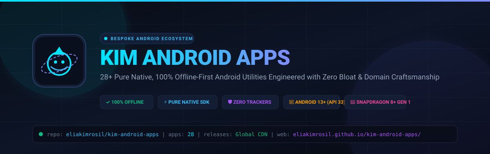
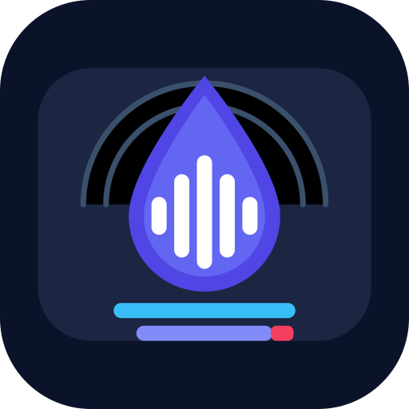
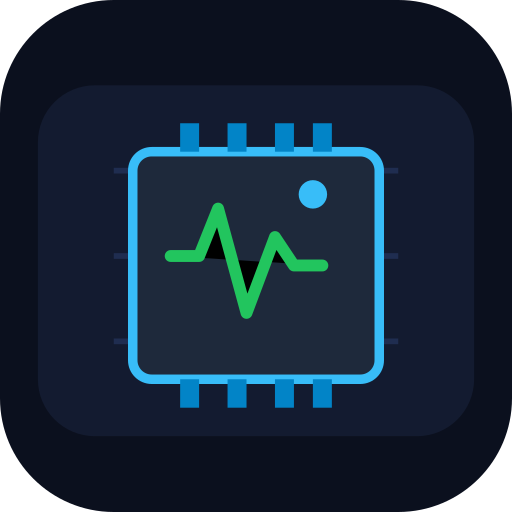
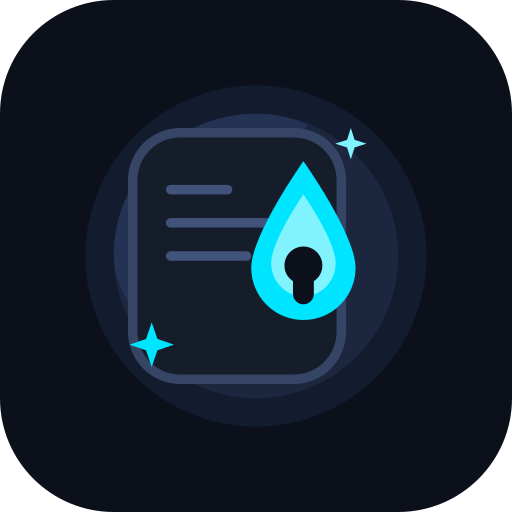
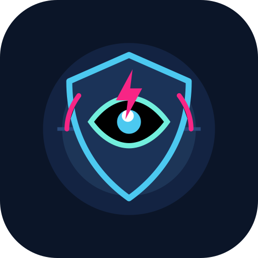

<p align="center">
  
</p>

<p align="center">
  <a href="https://android.com"></a>
  <a href="docs/ARCHITECTURE.md"></a>
  <a href="https://apps.kimrosil.com/"></a>
  <a href="SECURITY.md"></a>
  <a href="SECURITY.md"></a>
  <a href="LICENSE"></a>
  <a href="https://apps.kimrosil.com/"></a>
</p>

<p align="center">
  <b><a href="https://apps.kimrosil.com/">🌐 Web App Store</a></b> •
  <b><a href="https://github.com/eliakimrosil/kimrosil-app-studio/releases">📦 Releases &amp; Direct APKs</a></b> •
  <b><a href="docs/ARCHITECTURE.md">📐 Architecture</a></b> •
  <b><a href="docs/BESPOKE_DESIGN_GUIDELINES.md">🎨 Bespoke Design</a></b> •
  <b><a href="CONTRIBUTING.md">🤝 Feedback &amp; Issues</a></b> •
  <b><a href="SECURITY.md">🔒 Security Charter</a></b> •
  <b><a href="LICENSE">📄 License (EULA)</a></b>
</p>

---

## ⚡ Executive Summary

**KimRosil App Studio** is a curated suite of **31+ bespoke, privacy-first, ultra-lightweight Android applications**. Every utility is built natively using pure Android SDK 33 framework components (**Java + XML**) without heavyweight third-party runtime bloat, analytics spyware, or cloud lock-in.

This repository serves as the **Official Public Distribution Hub, Release Showcase, and Issue Tracker** for the ecosystem. All applications are distributed as **free-to-use proprietary freeware binaries** hosted globally via GitHub Releases CDN and GitHub Pages.

---

## 🏛️ Core Engineering Pillars

```
+---------------------------------------------------------------------------------------------------+
|                                  KIMROSIL APP STUDIO PILLARS                                         |
+---------------------------------+---------------------------------+-------------------------------+
|     🎨 BESPOKE CRAFTSMANSHIP    |      ⚡ PURE NATIVE SPEED       |    🛡️ ABSOLUTE PRIVACY       |
|  Tailored domain aesthetics,    |  Pure Java + XML, < 2 MB APKs,  |  100% offline-first, zero     |
|  high-contrast Day/Night modes, |  < 80 ms launch times, zero     |  trackers, zero ads, zero     |
|  adaptive Material You icons.   |  framework bloat, low battery.  |  cloud telemetry harvesting.  |
+---------------------------------+---------------------------------+-------------------------------+
```

1. **Domain-Tailored Bespoke Craftsmanship**: No cookie-cutter Material templates. Broadcast utilities adopt control-room obsidian and live ruby tally glows; hardware monitors sport tactical HUD gauges; culinary sentinels feature oversized, high-contrast rings designed for messy cooking hands.
2. **Adaptive Vector Icons & Material You**: Every application features bespoke multi-layered vector adaptive icons with full support for Android 13+ Material You dynamic wallpaper theming (`ic_launcher_monochrome.xml`).
3. **Pure Native Performance**: Zero React Native, Flutter, or third-party overhead. Pure Android SDK components ensure zero memory thrashing, smooth 60/120 FPS animations, and instantaneous cold starts (< 80 ms).
4. **Zero-Data Privacy Charter**: Zero advertising SDKs, zero crash beacons, zero telemetry. Offline tools never request or use internet permissions.
5. **Proprietary Freeware Model**: 100% free for personal and internal business use with zero ads and zero paywalls, while source code intellectual property remains strictly proprietary.

---

## 📱 Master Applications Catalog

Explore the full directory of applications across 7 core functional domains:

### 🎥 1. Broadcasting, Video & Audio

| Icon | Application | Version | Domain & Features | Downloads & Links |
| :---: | :--- | :---: | :--- | :--- |
|  | **KIM Live Studio**<br>`kim-live-studio` | `v1.2.0` | **Studio-Grade Mobile Live Streaming**<br>• Hardware `MediaCodec` H.264 &amp; AAC-LC RTMP/RTMPS streaming<br>• Floating Camera2 Facecam with in-flight 90° rotation &amp; resize<br>• Real-time broadcast telemetry HUD &amp; 5-segment LED VU meter | [⬇ Download APK (CDN)](https://github.com/eliakimrosil/kimrosil-app-studio/releases/download/v1.2.0-kim-live-studio/kim-live-studio.apk)<br>[🌐 Web Page](https://apps.kimrosil.com/kim-live-studio/) |
|  | **ScreenStream RTSP**<br>`screenstream-rtsp` | `v1.0.0` | **Low-Latency Screen Broadcaster**<br>• Local network RTSP screen mirror server<br>• Zero-latency Wi-Fi preview in VLC or OBS<br>• Real-time stream telemetry and client counter | [⬇ Download APK (CDN)](https://github.com/eliakimrosil/kimrosil-app-studio/releases/download/v1.0.0-screenstream-rtsp/screenstream-rtsp.apk)<br>[🌐 Web Page](https://apps.kimrosil.com/screenstream-rtsp/) |
|  | **DropScribe**<br>`offline-audio-drop-transcribe` | `v1.0.0` | **Offline Voice Drop &amp; Audio Transcribe**<br>• High-fidelity local voice recording<br>• On-device file queue management<br>• 100% private local audio storage | [⬇ Download APK (CDN)](https://github.com/eliakimrosil/kimrosil-app-studio/releases/download/v1.0.0-offline-audio-drop-transcribe/offline-audio-drop-transcribe.apk)<br>[🌐 Web Page](https://apps.kimrosil.com/offline-audio-drop-transcribe/) |

---

### ⚡ 2. System, Hardware Diagnostics & Device Bridges

| Icon | Application | Version | Domain & Features | Downloads & Links |
| :---: | :--- | :---: | :--- | :--- |
|  | **DevSys Monitor**<br>`devsys-monitor` | `v1.0.0` | **Real-Time Hardware &amp; SoC Telemetry**<br>• Per-core CPU frequency meters &amp; Snapdragon thermal gauges<br>• Live memory heap, swap, and storage bandwidth readouts<br>• Battery voltage, thermals, and real-time charging wattage | [⬇ Download APK (CDN)](https://github.com/eliakimrosil/kimrosil-app-studio/releases/download/v1.0.0-devsys-monitor/devsys-monitor.apk)<br>[🌐 Web Page](https://apps.kimrosil.com/devsys-monitor/) |
|  | **Gemini Power Bridge**<br>`gemini-power-bridge` | `v1.0.0` | **Hardware Key Interceptor for Lenovo ZUI**<br>• Custom physical power/side key hardware bridge<br>• Instant launch trigger for custom local commands or assistant<br>• Lightweight background service with 0% battery penalty | [⬇ Download APK (CDN)](https://github.com/eliakimrosil/kimrosil-app-studio/releases/download/v1.0.0-gemini-power-bridge/gemini-power-bridge.apk)<br>[🌐 Web Page](https://apps.kimrosil.com/gemini-power-bridge/) |

---

### 🔒 3. Privacy, Security & Ephemeral Utilities

| Icon | Application | Version | Domain & Features | Downloads & Links |
| :---: | :--- | :---: | :--- | :--- |
|  | **ClipScrub**<br>`clip-scrub-sanitize-share` | `v1.0.0` | **Private Link &amp; Text Sanitizer**<br>• Automatically strips tracking tokens (`utm_*`, `fbclid`, `gclid`)<br>• One-tap clean share target for incoming URLs<br>• Zero clipboard leaks, 100% on-device regex engine | [⬇ Download APK (CDN)](https://github.com/eliakimrosil/kimrosil-app-studio/releases/download/v1.0.0-clip-scrub-sanitize-share/clip-scrub-sanitize-share.apk)<br>[🌐 Web Page](https://apps.kimrosil.com/clip-scrub-sanitize-share/) |
|  | **StealthDrop**<br>`stealth-drop-secret-pad` | `v1.0.0` | **Ephemeral Scratchpad &amp; Secret Vault**<br>• Zero-footprint ephemeral text editor<br>• Self-destructing scratchpad sessions upon app minimization<br>• Memory-only buffer with zero unencrypted disk cache | [⬇ Download APK (CDN)](https://github.com/eliakimrosil/kimrosil-app-studio/releases/download/v1.0.0-stealth-drop-secret-pad/stealth-drop-secret-pad.apk)<br>[🌐 Web Page](https://apps.kimrosil.com/stealth-drop-secret-pad/) |

---

### 🍳 4. Culinary, Cooking & Defrost Sentinels

| Icon | Application | Version | Domain & Features | Downloads & Links |
| :---: | :--- | :---: | :--- | :--- |
|  | **ChillThaw**<br>`defrost-safe-meat-prep-sentinel` | `v1.0.0` | **Safe Meat Defrost Sentinel**<br>• USDA food-safety defrost countdown windows<br>• Refrigerator, cold water, and ambient defrost monitors<br>• 1-tap Quick Settings tile &amp; lock screen chronometer | [⬇ Download APK (CDN)](https://github.com/eliakimrosil/kimrosil-app-studio/releases/download/v1.0.0-defrost-safe-meat-prep-sentinel/defrost-safe-meat-prep-sentinel.apk)<br>[🌐 Web Page](https://apps.kimrosil.com/defrost-safe-meat-prep-sentinel/) |
|  | **RoastRest**<br>`roast-rest-meat-thermo-sentinel` | `v1.0.0` | **Carryover Meat Rest Sentinel**<br>• Offline culinary carryover temperature rise calculator<br>• Target rest timer preventing juice loss in steaks &amp; roasts<br>• Ongoing persistent lock screen chronometer | [⬇ Download APK (CDN)](https://github.com/eliakimrosil/kimrosil-app-studio/releases/download/v1.0.0-roast-rest-meat-thermo-sentinel/roast-rest-meat-thermo-sentinel.apk)<br>[🌐 Web Page](https://apps.kimrosil.com/roast-rest-meat-thermo-sentinel/) |
|  | **PanFlip**<br>`pan-flip-sear-timer` | `v1.0.0` | **Kitchen Sear &amp; Flip Sentinel**<br>• Hands-free pacing timer for perfect crusts and steaks<br>• High-contrast ring visible across the kitchen<br>• Quick Settings 1-tap start for busy home cooks | [⬇ Download APK (CDN)](https://github.com/eliakimrosil/kimrosil-app-studio/releases/download/v1.0.0-pan-flip-sear-timer/pan-flip-sear-timer.apk)<br>[🌐 Web Page](https://apps.kimrosil.com/pan-flip-sear-timer/) |
|  | **SteepPulse**<br>`steep-brew-tea-timer` | `v1.0.0` | **Multi-Infusion Tea &amp; Coffee Sentinel**<br>• Gongfu tea multi-infusion stepped stopwatch<br>• Specialty pour-over coffee bloom pacing<br>• Customizable water temp and leaf ratio presets | [⬇ Download APK (CDN)](https://github.com/eliakimrosil/kimrosil-app-studio/releases/download/v1.0.0-steep-brew-tea-timer/steep-brew-tea-timer.apk)<br>[🌐 Web Page](https://apps.kimrosil.com/steep-brew-tea-timer/) |
|  | **ThawGuard**<br>`frost-thaw-prep-timer` | `v1.0.0` | **Offline Food Defrost Sentinel**<br>• Precision weight-based thaw estimation<br>• Danger zone temperature alert warnings<br>• Reliable offline alarms via Android AlarmManager | [⬇ Download APK (CDN)](https://github.com/eliakimrosil/kimrosil-app-studio/releases/download/v1.0.0-frost-thaw-prep-timer/frost-thaw-prep-timer.apk)<br>[🌐 Web Page](https://apps.kimrosil.com/frost-thaw-prep-timer/) |
|  | **CrumbWatch**<br>`sourdough-rise-ferment-sentinel` | `v1.0.0` | **Sourdough Fermentation Sentinel**<br>• Ambient dough rise and stretch/fold timer<br>• Baker's percentage and hydration calculator<br>• Reliable offline alarms via Android AlarmManager | [🌐 Web Page](https://apps.kimrosil.com/sourdough-rise-ferment-sentinel/) |

---

### 🏃 5. Health, Fitness, Fasting & Commute Vigilance

| Icon | Application | Version | Domain & Features | Downloads & Links |
| :---: | :--- | :---: | :--- | :--- |
|  | **FastTrack**<br>`fast-track-intermittent-fasting-sentinel` | `v1.0.0` | **Offline Intermittent Fasting Sentinel**<br>• 16:8, 18:6, 20:4, and OMAD fasting protocols<br>• Persistent lock screen fasting chronometer<br>• Quick Settings tile 1-tap start/stop | [⬇ Download APK (CDN)](https://github.com/eliakimrosil/kimrosil-app-studio/releases/download/v1.0.0-fast-track-intermittent-fasting-sentinel/fast-track-intermittent-fasting-sentinel.apk)<br>[🌐 Web Page](https://apps.kimrosil.com/fast-track-intermittent-fasting-sentinel/) |
|  | **IronPulse**<br>`workout-program-tracker` | `v1.0.0` | **Offline Gym &amp; Workout Program Tracker**<br>• Zero-network workout logging for iron lifters<br>• 1RM calculations, set/rep counters, rest timers<br>• Offline SQLite database with local JSON export | [⬇ Download APK (CDN)](https://github.com/eliakimrosil/kimrosil-app-studio/releases/download/v1.0.0-workout-program-tracker/workout-program-tracker.apk)<br>[🌐 Web Page](https://apps.kimrosil.com/workout-program-tracker/) |
|  | **CryoPulse**<br>`steep-chill-ice-bath-timer` | `v1.0.0` | **Cold Plunge &amp; Ice Bath Sentinel**<br>• Haptic breath pacing for cold-water immersion<br>• Water temperature logging and adaptation curves<br>• High-visibility display readable through fog and water | [⬇ Download APK (CDN)](https://github.com/eliakimrosil/kimrosil-app-studio/releases/download/v1.0.0-steep-chill-ice-bath-timer/steep-chill-ice-bath-timer.apk)<br>[🌐 Web Page](https://apps.kimrosil.com/steep-chill-ice-bath-timer/) |
|  | **SnoozeGuard**<br>`snooze-guard-microsleep-commute` | `v1.0.0` | **Public Transit Commute Vigil**<br>• Dead-man vigilance timer preventing missed stops<br>• Device motion awareness via internal accelerometer<br>• Escalating multi-stage haptic wake alarms | [⬇ Download APK (CDN)](https://github.com/eliakimrosil/kimrosil-app-studio/releases/download/v1.0.0-snooze-guard-microsleep-commute/snooze-guard-microsleep-commute.apk)<br>[🌐 Web Page](https://apps.kimrosil.com/snooze-guard-microsleep-commute/) |
|  | **AuraFocus**<br>`aurafocus-minimalist-pomodoro-ambient-sound` | `v1.0.0` | **Minimalist Pomodoro &amp; Ambient Sound**<br>• Distraction-free work/break interval chronometer<br>• Pure offline procedural ambient noise generator<br>• Minimalist OLED true-black aesthetic | [⬇ Download APK (CDN)](https://github.com/eliakimrosil/kimrosil-app-studio/releases/download/v1.0.0-aurafocus-minimalist-pomodoro-ambient-sound/aurafocus-minimalist-pomodoro-ambient-sound.apk)<br>[🌐 Web Page](https://apps.kimrosil.com/aurafocus-minimalist-pomodoro-ambient-sound/) |
|  | **DoseGuard**<br>`offline-prescription-pill-refill-sentinel` | `v1.0.0` | **Offline Med &amp; Refill Sentinel**<br>• Private local medication schedule alarms<br>• Pill inventory depletion and refill date projections<br>• 100% offline medical privacy guarantee | [⬇ Download APK (CDN)](https://github.com/eliakimrosil/kimrosil-app-studio/releases/download/v1.0.0-offline-prescription-pill-refill-sentinel/offline-prescription-pill-refill-sentinel.apk)<br>[🌐 Web Page](https://apps.kimrosil.com/offline-prescription-pill-refill-sentinel/) |

---

### 🛠️ 6. Daily Utilities, Woodworking & Hardware Tools

| Icon | Application | Version | Domain & Features | Downloads & Links |
| :---: | :--- | :---: | :--- | :--- |
|  | **ClampGuard**<br>`glue-set-clamp-sentinel` | `v1.0.0` | **Woodworking Glue &amp; Epoxy Cure Sentinel**<br>• PVA, polyurethane, and epoxy cure window calculators<br>• Ambient workshop temperature compensation<br>• 1-tap Quick Settings tile &amp; lock screen timer | [⬇ Download APK (CDN)](https://github.com/eliakimrosil/kimrosil-app-studio/releases/download/v1.0.0-glue-set-clamp-sentinel/glue-set-clamp-sentinel.apk)<br>[🌐 Web Page](https://apps.kimrosil.com/glue-set-clamp-sentinel/) |
|  | **MeterPulse**<br>`tap-meter-parking-sentinel` | `v1.0.0` | **Offline Parking Meter Sentinel**<br>• 1-tap parking expiration timer from Quick Settings<br>• Escalating notifications before meter expiration<br>• Visual color-coded countdown HUD | [⬇ Download APK (CDN)](https://github.com/eliakimrosil/kimrosil-app-studio/releases/download/v1.0.0-tap-meter-parking-sentinel/tap-meter-parking-sentinel.apk)<br>[🌐 Web Page](https://apps.kimrosil.com/tap-meter-parking-sentinel/) |
|  | **ParkPin**<br>`park-pin-offline-spot-finder` | `v1.0.0` | **Offline Vehicle Spot Anchor**<br>• GPS coordinate anchor without cloud mapping APIs<br>• Offline compass bearing and distance vector<br>• Floor level, zone, and parking stall note memo | [⬇ Download APK (CDN)](https://github.com/eliakimrosil/kimrosil-app-studio/releases/download/v1.0.0-park-pin-offline-spot-finder/park-pin-offline-spot-finder.apk)<br>[🌐 Web Page](https://apps.kimrosil.com/park-pin-offline-spot-finder/) |
|  | **CycleGuard**<br>`laundry-cycle-sentinel` | `v1.0.0` | **Laundry Cycle Sentinel**<br>• Washer, dryer, and soak countdown pacing<br>• Wrinkle-guard reminder alerts<br>• Quick Settings tile 1-tap activation | [⬇ Download APK (CDN)](https://github.com/eliakimrosil/kimrosil-app-studio/releases/download/v1.0.0-laundry-cycle-sentinel/laundry-cycle-sentinel.apk)<br>[🌐 Web Page](https://apps.kimrosil.com/laundry-cycle-sentinel/) |
|  | **TankPulse**<br>`offline-fuel-log-tracker` | `v1.0.0` | **Offline Fuel &amp; Mileage Tracker**<br>• Exact L/100km or MPG efficiency calculation<br>• Total operating cost and odometer tracking<br>• Fully sandboxed SQLite local records | [⬇ Download APK (CDN)](https://github.com/eliakimrosil/kimrosil-app-studio/releases/download/v1.0.0-offline-fuel-log-tracker/offline-fuel-log-tracker.apk)<br>[🌐 Web Page](https://apps.kimrosil.com/offline-fuel-log-tracker/) |
|  | **ReturnGuard**<br>`return-guard-receipt-countdown` | `v1.0.0` | **Store Return Deadline &amp; Receipt Viewer**<br>• Days-remaining return countdowns for purchases<br>• High-contrast receipt image and policy storage<br>• Timely alerts before return windows close | [⬇ Download APK (CDN)](https://github.com/eliakimrosil/kimrosil-app-studio/releases/download/v1.0.0-return-guard-receipt-countdown/return-guard-receipt-countdown.apk)<br>[🌐 Web Page](https://apps.kimrosil.com/return-guard-receipt-countdown/) |
|  | **WhoHasMy**<br>`who-has-my-tool-lending` | `v1.0.0` | **Tool &amp; Gear Lending Tracker**<br>• Keep track of who borrowed tools and workshop gear<br>• Return due date reminders and contact tags<br>• 100% offline local record | [⬇ Download APK (CDN)](https://github.com/eliakimrosil/kimrosil-app-studio/releases/download/v1.0.0-who-has-my-tool-lending/who-has-my-tool-lending.apk)<br>[🌐 Web Page](https://apps.kimrosil.com/who-has-my-tool-lending/) |
|  | **PotLife**<br>`epoxy-cure-pot-life-sentinel` | `v1.0.0` | **Epoxy &amp; Resin Cure Sentinel**<br>• Real-time exothermic pot life countdowns<br>• Mixed mass &amp; workshop temperature compensation<br>• Demold and full mechanical cure tracking | [⬇ Download APK (CDN)](https://github.com/eliakimrosil/kimrosil-app-studio/releases/download/v1.0.0-epoxy-cure-pot-life-sentinel/epoxy-cure-pot-life-sentinel.apk)<br>[🌐 Web Page](https://apps.kimrosil.com/epoxy-cure-pot-life-sentinel/) |
|  | **Caulk Bead &amp; Skin Sentinel**<br>`caulk-bead-skin-sentinel` | `v1.0.0` | **Caulk Tooling &amp; Cure Sentinel**<br>• Silicone, acrylic, and polyurethane tooling windows<br>• Temperature and humidity skin-over estimator<br>• Paintable &amp; water-ready countdown alarms | [⬇ Download APK (CDN)](https://github.com/eliakimrosil/kimrosil-app-studio/releases/download/v1.0.0-caulk-bead-skin-sentinel/caulk-bead-skin-sentinel.apk)<br>[🌐 Web Page](https://apps.kimrosil.com/caulk-bead-skin-sentinel/) |
|  | **SizeVault**<br>`size-vault-family-clothing` | `v1.0.0` | **Family Clothing &amp; Shoe Size Guide**<br>• Instant offline lookup for family shoe and clothing sizes<br>• US, UK, EU, and Asian size conversion charts<br>• Gift-shopping quick reference | [⬇ Download APK (CDN)](https://github.com/eliakimrosil/kimrosil-app-studio/releases/download/v1.0.0-size-vault-family-clothing/size-vault-family-clothing.apk)<br>[🌐 Web Page](https://apps.kimrosil.com/size-vault-family-clothing/) |

---

### 💼 7. Finance, Documents & Productivity

| Icon | Application | Version | Domain & Features | Downloads & Links |
| :---: | :--- | :---: | :--- | :--- |
|  | **PH VAT Calculator**<br>`ph-vat-calculator` | `v1.0.0` | **Philippine BIR Tax &amp; Invoice Tool**<br>• 12% Value Added Tax calculation (inclusive &amp; exclusive)<br>• BIR withholding tax (EWT 1%, 2%, 5%) breakdown<br>• Clear tabular output for freelance and enterprise billing | [⬇ Download APK (CDN)](https://github.com/eliakimrosil/kimrosil-app-studio/releases/download/v1.0.0-ph-vat-calculator/ph-vat-calculator.apk)<br>[🌐 Web Page](https://apps.kimrosil.com/ph-vat-calculator/) |
|  | **SnipShelf**<br>`snip-shelf-receipt-ocr` | `v1.0.0` | **Offline Warranty &amp; Manual Vault**<br>• Local catalog for product warranties and serial numbers<br>• On-device document snapshot viewer<br>• Expiration alerts for major home appliances | [⬇ Download APK (CDN)](https://github.com/eliakimrosil/kimrosil-app-studio/releases/download/v1.0.0-snip-shelf-receipt-ocr/snip-shelf-receipt-ocr.apk)<br>[🌐 Web Page](https://apps.kimrosil.com/snip-shelf-receipt-ocr/) |

---

## 📦 How to Install Applications

### Option 1: Direct APK Download (Recommended)
Every application binary is compiled, signed, and hosted on **GitHub Releases Global CDN**:
1. Open the [GitHub Releases Page](https://github.com/eliakimrosil/kimrosil-app-studio/releases).
2. Download the `.apk` file for your desired app.
3. Tap the downloaded file on your Android device to install.

### Option 2: Web App Store
Visit the official **[KimRosil App Studio Web Portal](https://apps.kimrosil.com/)** on your phone or desktop to search, filter by category, and download APKs in one tap.

### Option 3: Direct ADB Install (Developers)
If connected to your phone via USB or wireless ADB:
```bash
adb install -r <app-name>.apk
```

---

## 🔒 Privacy & Data Safety Charter

We believe that basic mobile utilities should respect user sovereignty:

- **100% Offline-First Core**: Application utility computations, user records, and databases operate strictly on your device.
- **Zero Proprietary Server Tracking**: We do not maintain remote user tracking databases or harvest personal information.
- **Local Sandboxed Storage Only**: User configuration, files, logs, and state are stored strictly within Android's private app sandbox.
- **Master Developer Privacy Policy**: For comprehensive Google Play Data Safety declarations and AdMob partner disclosures, visit the **[Master Developer Privacy Policy](https://apps.kimrosil.com/privacy.html)**.
- **Google AdMob Authorized Sellers**: AdMob publisher verification is maintained at **[app-ads.txt](https://apps.kimrosil.com/app-ads.txt)**.

For detailed security policies or to report a vulnerability, review our [Security Charter](SECURITY.md).

---

## 🤝 Community Feedback & Issue Reporting

We actively maintain all applications in this suite. If you find a bug or have an idea for an offline utility:
- [Submit a Bug Report](https://github.com/eliakimrosil/kimrosil-app-studio/issues/new?template=bug_report.yml)
- [Propose a Feature Request](https://github.com/eliakimrosil/kimrosil-app-studio/issues/new?template=feature_request.yml)
- [Propose a New App Concept](https://github.com/eliakimrosil/kimrosil-app-studio/issues/new?template=new_app_proposal.yml)

---

## 📄 License & Intellectual Property

All applications, binaries, and documentation in this ecosystem are distributed as **Proprietary Freeware** under the [Proprietary Freeware EULA](LICENSE).

Copyright &copy; 2026 **[Eliakim Rosil](https://github.com/eliakimrosil)**. All Rights Reserved.

- **Free for Personal & Internal Use**: Free to download, install, and execute.
- **Strictly Proprietary**: Reverse engineering, decompilation, rebranding, and unauthorized marketplace redistribution are prohibited.
